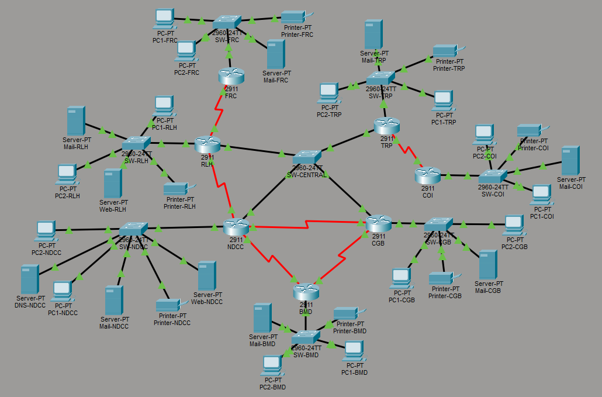

# 🌊 CoastNet — Cyclone Early-Warning & Coastal Relief Network

<p align="center">
  
</p>

<p align="center">
  <b>A Cisco Packet Tracer-based resilient communication network for cyclone early-warning, emergency coordination, and coastal relief operations.</b>
</p>

---

## 📌 Overview

**CoastNet** is a fully designed and configured enterprise-style network built in **Cisco Packet Tracer** for a hypothetical Bangladesh coastal disaster-response infrastructure.

The network connects seven operational units involved in cyclone warning, rescue, logistics, meteorological monitoring, telecommunications, and remote-island operations:

- **NDCC** — National Disaster Control Center
- **BMD** — Meteorological Radar Station
- **CGB** — Coast Guard Base
- **RLH** — Relief Logistics Hub
- **FRC** — Field Rescue Camp
- **TRP** — Telecom Relay Post
- **COI** — Remote Char (Island) Outpost

The project demonstrates **VLSM addressing, DHCP, DHCP relay, DNS, email, web services, static routing, RIPv2, route redistribution, recursive static routing, floating static routing, and end-to-end network verification**.

The complete topology and configuration are provided as a Cisco Packet Tracer `.pkt` project.

---

## 🎯 Project Objectives

The network was designed to satisfy the following requirements:

- Build a seven-unit routed network using Cisco routers and switches.
- Use **VLSM** to efficiently divide the `7.13.0.0/16` address space.
- Provide DHCP according to the operational requirements of each unit.
- Use **NDCC as the central DNS server**.
- Provide local email servers for every unit.
- Support two-way email communication between `ndcc.gov` and `rlh.gov`.
- Provide dedicated web servers for NDCC and RLH.
- Allow all devices to access both web services by domain name.
- Implement **RIPv2** across the warning-loop routers.
- Redistribute NDCC's static routes into RIPv2.
- Configure required static routes on RLH, TRP, FRC, and COI.
- Implement routing redundancy using:
  - Recursive static routing
  - Floating static routing
- Verify end-to-end connectivity and service availability.

---

## 🏗️ Network Architecture

### Operational Units

| Unit | Abbreviation | Host Requirement | LAN |
|---|---|---:|---|
| National Disaster Control Center | NDCC | 280 | `7.13.0.0/23` |
| Coast Guard Base | CGB | 200 | `7.13.2.0/24` |
| Relief Logistics Hub | RLH | 220 | `7.13.3.0/24` |
| Telecom Relay Post | TRP | 90 | `7.13.4.0/25` |
| Meteorological Radar Station | BMD | 150 | `7.13.5.0/24` |
| Field Rescue Camp | FRC | 130 | `7.13.6.0/24` |
| Remote Char (Island) Outpost | COI | 40 | `7.13.7.0/26` |

Each operational unit contains:

- 1 × Cisco 2911 router
- 1 × LAN switch
- 2 × PCs representing the unit's hosts/agents
- 1 × network printer
- Required server infrastructure

Router-to-router connections use serial links, while LAN connections use Ethernet.

---

## 🌐 Topology Design

CoastNet contains three important routing structures.

### 1. Central Hub

NDCC, CGB, RLH, and TRP connect through a shared central switch.

An additional direct point-to-point link connects:

```text
NDCC ↔ RLH
```

This additional path provides redundancy for the NDCC–RLH connection.

### 2. Warning Loop

The three warning-related units form a routing loop:

```text
        NDCC
       /    \
     BMD ↔ CGB
```

More specifically:

```text
NDCC ↔ BMD
BMD  ↔ CGB
CGB  ↔ NDCC
```

RIPv2 is used across these three routers.

### 3. Remote / Edge Connections

```text
RLH ↔ FRC

TRP ↔ COI
```

FRC has only one connection to RLH, while COI has only one connection to TRP.

---

## 🧮 VLSM Addressing

The base network is:

```text
7.13.0.0/16
```

The network was subnetted using VLSM in the required allocation order.

### VLSM Allocation

```text
7.13.0.0/16
│
├── 7.13.0.0/23   → NDCC
├── 7.13.2.0/24   → CGB
├── 7.13.3.0/24   → RLH
├── 7.13.4.0/25   → TRP
├── 7.13.5.0/24   → BMD
├── 7.13.6.0/24   → FRC
├── 7.13.7.0/26   → COI
│
├── 7.13.7.64/29  → Central Switch Network
├── 7.13.7.72/30  → NDCC ↔ RLH
├── 7.13.7.76/30  → NDCC ↔ BMD
├── 7.13.7.80/30  → BMD ↔ CGB
├── 7.13.7.84/30  → CGB ↔ NDCC
├── 7.13.7.88/30  → RLH ↔ FRC
└── 7.13.7.92/30  → TRP ↔ COI
```

### Router / Server Addressing

| Unit | Router Gateway | Printer | Mail Server | Other Server |
|---|---|---|---|---|
| NDCC | `7.13.0.1` | `7.13.0.2` | `7.13.0.3` | Web `7.13.0.4`, DNS `7.13.0.5` |
| CGB | `7.13.2.1` | `7.13.2.2` | `7.13.2.3` | — |
| RLH | `7.13.3.1` | `7.13.3.2` | `7.13.3.3` | Web `7.13.3.4` |
| TRP | `7.13.4.1` | `7.13.4.2` | `7.13.4.3` | — |
| BMD | `7.13.5.1` | `7.13.5.2` | `7.13.5.3` | — |
| FRC | `7.13.6.1` | `7.13.6.2` | `7.13.6.3` | — |
| COI | `7.13.7.1` | `7.13.7.2` | `7.13.7.3` | — |

---

## 🔄 Routing

CoastNet combines **dynamic routing and static routing**.

### RIPv2

RIPv2 is configured on:

- NDCC
- BMD
- CGB

These routers form the Warning Loop.

NDCC also redistributes its static routes into RIPv2:

```text
router rip
 version 2
 no auto-summary
 network 7.0.0.0
 redistribute static metric 1
```

This allows BMD and CGB to learn routes to networks outside the Warning Loop without requiring individual static routes on those routers.

### Static Routing

Static routes are used on:

- NDCC
- RLH
- TRP
- FRC
- COI

Different routing styles are demonstrated:

- Exit-interface static routes
- Next-hop static routes
- Recursive static routes
- Default static route
- Floating static route

### COI Default Route

COI has only one path to the rest of the network, through TRP:

```text
COI → TRP → Core
```

Therefore, COI uses a default static route through its TRP-facing serial interface.

### FRC Exit-Interface Routing

FRC is required to use exit-interface static routes for external networks.

Example:

```text
ip route 7.13.0.0 255.255.254.0 Serial0/1/0
```

---

## 🛡️ Routing Redundancy

The project demonstrates two different backup-routing techniques.

### RLH Recursive Static Backup

RLH has a primary route toward NDCC through the direct NDCC–RLH link.

A recursive backup route is configured through TRP:

```text
ip route 7.13.0.0 255.255.254.0 7.13.7.68 5
```

If the direct NDCC–RLH path fails, the backup route becomes active.

### TRP Floating Static Route

TRP maintains a floating static backup route toward NDCC through CGB:

```text
ip route 7.13.0.0 255.255.254.0 7.13.7.66 57
```

The administrative distance is calculated from the project requirement:

```text
AD = (sum of all digits of Member 1's ID) × (number of group members)
```

For the implemented group:

```text
AD = 19 × 3 = 57
```

Because the floating route has a higher administrative distance than the primary route, it remains inactive until the primary route is unavailable.

---

## 📡 DHCP

The project implements multiple DHCP scenarios.

### NDCC DHCP Server

NDCC provides DHCP service for:

- NDCC
- BMD
- CGB

BMD and CGB use DHCP relay with:

```text
ip helper-address 7.13.0.1
```

### RLH DHCP Server

RLH provides DHCP for:

- RLH
- FRC

FRC forwards DHCP requests to RLH using:

```text
ip helper-address 7.13.3.1
```

### TRP DHCP Server

TRP provides DHCP for:

- TRP
- COI

COI uses:

```text
ip helper-address 7.13.4.1
```

All DHCP pools provide the central DNS server:

```text
7.13.0.5
```

Static device addresses are excluded from DHCP pools to prevent address conflicts.

---

## 🌍 Central DNS

NDCC hosts the only central DNS server:

```text
DNS Server: 7.13.0.5
```

All devices use this DNS server.

Important records include:

| DNS Record | Address |
|---|---|
| `www.ndcc.relief.gov` | `7.13.0.4` |
| `www.rlh.relief.gov` | `7.13.3.4` |
| `mail.ndcc.gov` | `7.13.0.3` |
| `mail.cgb.gov` | `7.13.2.3` |
| `mail.rlh.gov` | `7.13.3.3` |
| `mail.trp.gov` | `7.13.4.3` |
| `mail.bmd.gov` | `7.13.5.3` |
| `mail.frc.gov` | `7.13.6.3` |
| `mail.coi.gov` | `7.13.7.3` |
| `ndcc.gov` | `7.13.0.3` |
| `rlh.gov` | `7.13.3.3` |

The bare `ndcc.gov` and `rlh.gov` records are included to support cross-domain SMTP relay in Packet Tracer.

---

## 📧 Email Services

Every operational unit has its own local mail server.

The project uses:

- SMTP
- POP3
- DNS-based mail server resolution

### Cross-Domain Email

The main cross-domain communication requirement is:

```text
officer1@ndcc.gov
        ↕
logistics1@rlh.gov
```

Two accounts are configured on each of the NDCC and RLH mail servers, allowing communication in both directions.

Local mail services are also configured for:

- CGB
- TRP
- BMD
- FRC
- COI

---

## 🌐 Web Services

Two dedicated web servers are deployed.

### NDCC

```text
Domain: www.ndcc.relief.gov
IP:     7.13.0.4
```

### RLH

```text
Domain: www.rlh.relief.gov
IP:     7.13.3.4
```

Both websites can be accessed by domain name from PCs across the seven operational units.

---

## 🖥️ Network Services Summary

| Service | Location | Purpose |
|---|---|---|
| DHCP | NDCC | NDCC, BMD, CGB address assignment |
| DHCP | RLH | RLH and FRC address assignment |
| DHCP | TRP | TRP and COI address assignment |
| DNS | NDCC | Central name resolution |
| Email | All units | Local email communication |
| Cross-domain Email | NDCC ↔ RLH | Inter-agency communication |
| Web Server | NDCC | `www.ndcc.relief.gov` |
| Web Server | RLH | `www.rlh.relief.gov` |
| RIPv2 | NDCC, BMD, CGB | Dynamic routing |
| Static Routing | Multiple routers | External network reachability |
| Route Redistribution | NDCC | Inject static routes into RIPv2 |
| Redundancy | RLH, TRP | Automatic backup routing |

---

## 🔧 Cisco Technologies / Concepts Demonstrated

- Cisco 2911 routers
- Cisco 2960 switches
- VLSM
- IPv4 subnetting
- Serial point-to-point links
- DCE / DTE
- `clock rate`
- Static routing
- Recursive static routing
- Floating static routing
- RIPv2
- Route redistribution
- DHCP
- DHCP relay / `ip helper-address`
- DNS
- SMTP
- POP3
- HTTP
- Default routes
- Administrative Distance
- End-to-end connectivity testing

---

## 🧪 Testing & Verification

The completed network was tested for:

### Connectivity

- Inter-unit PC-to-PC communication
- Router-to-router communication
- Multi-hop routing
- Longest-path connectivity

### DHCP

- Dynamic IP assignment
- DHCP relay from BMD and CGB to NDCC
- DHCP relay from FRC to RLH
- DHCP relay from COI to TRP

### DNS

Domain-name resolution for the configured web and mail records was tested from remote units.

### Email

Two-way communication was verified between:

```text
ndcc.gov ↔ rlh.gov
```

### Web

Both websites were verified from a remote unit:

```text
www.ndcc.relief.gov
www.rlh.relief.gov
```

### Failover

Two routing-failover scenarios were demonstrated:

1. **RLH recursive backup route**
2. **TRP floating static route**

The primary route was disabled/removed during testing, the backup route became active, and connectivity was restored.

---

## 📂 Repository Contents

```text
CoastNet-Cyclone-Early-Warning-Coastal-Relief-Network/
│
├── coast_net.pkt
│   └── Complete Cisco Packet Tracer topology and configuration
│
├── topology.png
│   └── Network topology diagram
│
├── 2. CoastNet_ Cyclone Early-Warning & Coastal Relief Network.pdf
│   └── Project/assignment requirements
│
├── 421.pdf
│   └── VLSM, IP addressing and router configuration documentation
│
├── dns table.docx
│   └── Central DNS record table
│
├── EXPLANATION.md
│   └── Detailed implementation notes, configuration reasoning and testing log
│
└── README.md
    └── Project overview and documentation
```

---

## 🚀 How to Run / Explore the Project

### 1. Install Cisco Packet Tracer

Install a compatible version of **Cisco Packet Tracer**.

### 2. Open the Packet Tracer project

Open:

```text
coast_net.pkt
```

### 3. Inspect the topology

Review the seven operational units, routers, switches, PCs, printers, servers, and inter-router links.

### 4. Test DHCP

On a PC:

```text
Desktop → IP Configuration → DHCP
```

Confirm that the PC receives an address from the correct DHCP pool.

### 5. Test connectivity

From a PC:

```text
ping <destination-IP>
```

### 6. Test DNS

Example:

```text
ping www.ndcc.relief.gov
```

or:

```text
ping www.rlh.relief.gov
```

### 7. Test websites

Open a PC browser and visit:

```text
http://www.ndcc.relief.gov
http://www.rlh.relief.gov
```

### 8. Test email

Use the configured Packet Tracer email clients to verify communication between the NDCC and RLH domains.

### 9. Inspect routing

On routers:

```text
show ip route
show ip protocols
show ip interface brief
```

### 10. Test failover

The Packet Tracer topology can be used to reproduce the documented routing-failure scenarios and observe the backup routes becoming active.

---

## 👥 Work Distribution

The project was divided into three primary configuration areas:

| Member | Primary Responsibility |
|---|---|
| Member 1 | DHCP and Email |
| Member 2 | Static Routing and Routing Redundancy |
| Member 3 | Dynamic Routing, RIPv2 and Route Redistribution |

Other activities, including topology design, addressing, DNS, web services, testing, and documentation, were shared among the group.

---

## 📚 Documentation

For detailed implementation information, refer to:

- **`EXPLANATION.md`** — complete phase-by-phase technical explanation
- **`421.pdf`** — VLSM, subnet allocation, IP addressing, and router configurations
- **`dns table.docx`** — DNS records
- **`2. CoastNet_ Cyclone Early-Warning & Coastal Relief Network.pdf`** — original project requirements

---

## 💡 Key Networking Concepts

This project demonstrates how several networking mechanisms work together rather than in isolation:

```text
VLSM
  ↓
IP Addressing
  ↓
DHCP / DHCP Relay
  ↓
Routing
  ├── Static Routing
  └── RIPv2 + Redistribution
  ↓
DNS
  ↓
Email / Web Services
  ↓
End-to-End Connectivity
  ↓
Routing Redundancy & Failover
```

The project therefore provides a practical Cisco Packet Tracer example of designing and troubleshooting a multi-site network with both centralized services and resilient routing.

---

## ⚠️ Note

This is an **academic Cisco Packet Tracer networking project**. The network, domain names, addressing scheme, and services are simulated for educational purposes and are not an operational disaster-response network.

---

## 👨‍💻 Project

**CoastNet — Cyclone Early-Warning & Coastal Relief Network**

Built with:

- Cisco Packet Tracer
- Cisco IOS routing concepts
- IPv4 / VLSM
- DHCP
- DNS
- SMTP / POP3
- HTTP
- RIPv2
- Static Routing
- Route Redistribution
- Routing Redundancy
